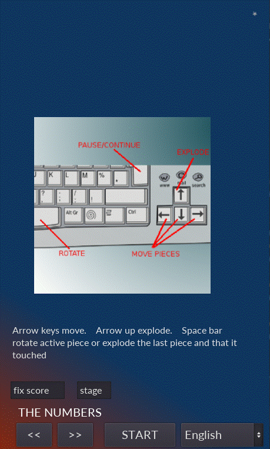
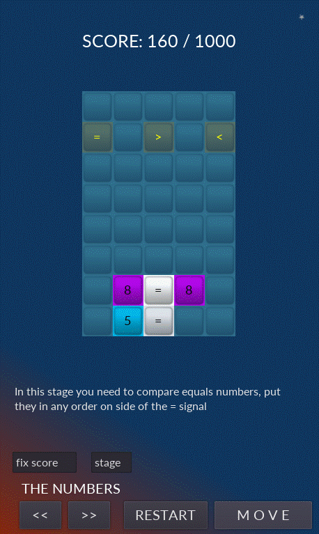
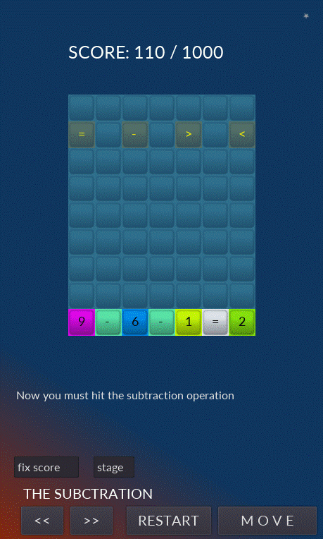
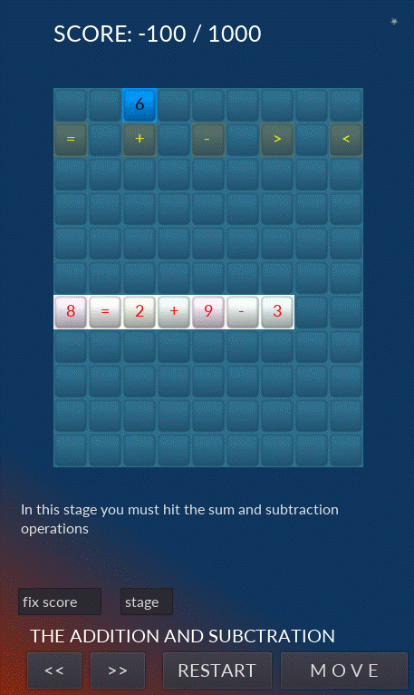
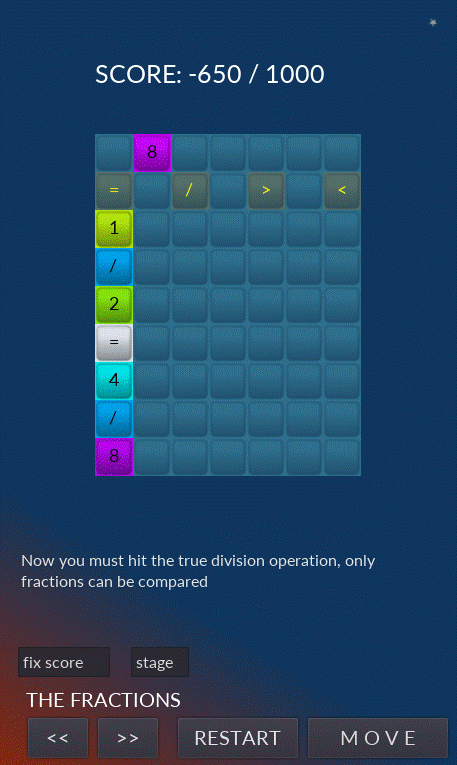
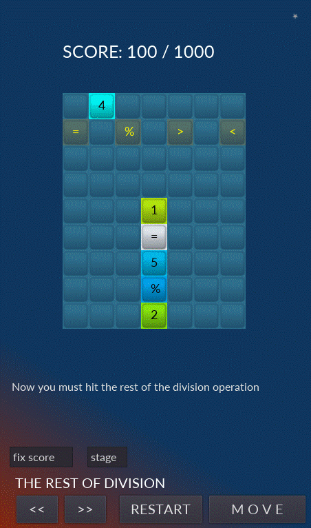
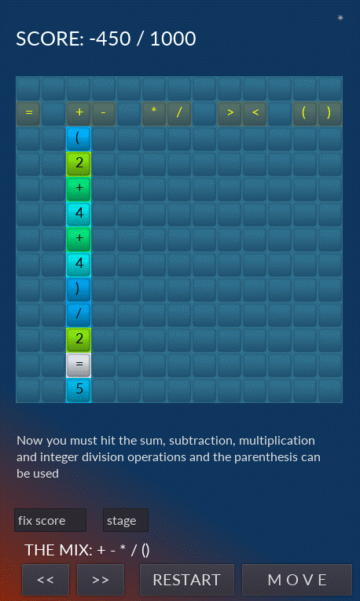

# **Tetris Math**

  

# Acerca de
> - Este juego 2D es parte de un conjunto experimental de juegos educativos que se construyó usando el Godot engine y usando el lenguaje GDScript (similar a python)  
> - Puedes jugar un juego de tetris resolviendo muchas formas de operaciones matemáticas.  

# Aspectos
> - El juego se rediseñará por completo y se corregirán algunos errores menores. 
> - El juego se puede jugar en portugués o inglés.
> - La página de inicio contiene instrucciones básicas. (ver en los diseños a continuación)
> - En la primera línea se genera un número aleatorio que se mueve horizontalmente.
> - En la segunda línea, el número mencionado anteriormente se puede cambiar en algunos de los símbolos marcados en el mismo o agregar '>' o reducir '<' en una unidad.
> - Atención: a veces se generan dos números conjugados, por lo que uno de ellos necesariamente pasará por un símbolo y será cambiado.
> - Cuando acertass una ecuación (una igualdad) explotará sus números y símbolos y se agregarán puntos al marcador.
> - Cuando explotas un solo número se descuentan puntos del marcador.
> - En cualquier momento puede cambiar la dirección del número activo.
> - Cuando el número choca con cualquier contorno, se pegará a él.
> - Puede acelerar el número activo apuntándolo en la misma dirección.
> - Puedes hacer que el número vaya paso a paso presionando el botón de pausa.
> - Cualquier comparación o igualdad se puede hacer horizontal o verticalmente.
> - En cualquier momento puedes cambiar los niveles presionando los botones '<<' y '>>', pausar o reiniciar el juego.
> - El grado de complejidad de cada nivel va en aumento, los ejemplos a continuación (diseños) son los pasos iniciales y son tambien la solución más sencilla.
> ---
> - El juego tiene trece niveles (fases) diferentes:
> - 1. Compara dos enteros
> - 2. Compara números arábigos y romanos.
> - 3. Resuelve la suma de dos números enteros.
> - 4. Resuelve la resta de dos enteros.
> - 5. Resolver una mezcla de sumas y restas.
> - 6. Resuelve la multiplicación de dos enteros.
> - 7. Resuelve la división de dos enteros con resto cero.
> - 8. Compara fracciones.
> - 9. Resuelve el resto de la división de dos enteros.
> - 10. Resolver una mezcla de suma, resta y multiplicación.
> - 11. Igual que arriba con el uso de paréntesis.
> - 12. Resuelve una mezcla de suma, resta, multiplicación y división, puedes usar paréntesis.
> - 13. Resuelve una mezcla de todas las operaciones anteriores.

# Diseños
> ## Página de inicio con instrucciones básicas
> - Los campos 'fixed scores' y 'stage' están presentes solo en el modo de desarrollo. A través de ellos puedes saltar a diferentes niveles y fijar tantos puntos como quieras en el marcador. Esta es la página para configurar el idioma a portugués o inglés.  
> 

> ## Nivel típico 1: comparar dos números
> - La igualdad '8 = 8' estallará en el siguiente segundo y se sumarán puntos al marcador.  
> 

> ## Nivel típico 2 - Comparación de números arábigos y romanos
> - La igualdad 'I = 1' explotará en el siguiente segundo y se sumarán puntos al marcador.  
> 

> ## Nivel típico 3 - Resolución de sumas
> - La igualdad '7 = 1 + 6' explotará en el siguiente segundo y se sumarán puntos al marcador. Esta ecuación parpadeará y cambiará de color antes de explotar, por lo que sus números son rojos sobre un fondo blanco (este es el comportamiento predeterminado). Tenga en cuenta que el número 1 está caminando en la primera línea, use siempre la flecha hacia abajo para usarlo correctamente.  
> 

> ## Nivel típico 4 - Resolución de restas
> - La igualdad '9 - 6 - 1 = 2' explotará en el siguiente segundo y se sumarán puntos al marcador.  
> 

> ## Nivel típico 5: resolución de sumas y restas
> - La igualdad '8 = 2 + 9 - 3' explotará en el siguiente segundo y se sumarán puntos al marcador. Esta ecuación parpadeará y cambiará de color antes de explotar, por lo que sus números son rojos sobre un fondo blanco. (Este es el comportamiento predeterminado)  
> 

> ## Nivel Típico 6 - Resolver Multiplicaciones
>- La igualdad '15=3*5' explotará en el próximo segundo y se agregarán puntos al marcador. Tenga en cuenta que las ecuaciones pueden ser verticales.    
> 

> ## Nivel típico 7 - Resolución de divisiones
> - La igualdad '6/2=3' estallará en el siguiente segundo y se agregarán puntos al marcador. Tenga en cuenta que las ecuaciones pueden ser verticales.  
>   

> ## Nivel típico 8 - Comparación de dos fracciones
> - La igualdad '1/2 = 4/8' explotará en el siguiente segundo y se sumarán puntos al marcador.  
> 

> ## Nivel típico 9 - Resolviendo el resto de las divisiones
> - La igualdad '1 = 5 % 2' explotará en el siguiente segundo y se agregarán puntos al marcador. Tenga en cuenta que las ecuaciones pueden ser verticales. En este caso, 5 dividido por dos es igual a 2 como resto de 1 (5/2 = 2*2+1), o resto, no el caso 1, es el valor que queremos calcular como el operador '%'.  
> 

> ## Nivel típico 10 - Resolución de sumas, restas y multiplicaciones
> - La igualdad '5 * 4 = 7 + 7 + 7 - 1' explotará en el siguiente segundo y se sumarán puntos al marcador. Esta ecuación parpadeará y cambiará de color antes de explotar, por lo que sus números son rojos sobre un fondo blanco (este es el comportamiento predeterminado).   
> 

> ## Nivel típico 10 en portugués - Resolución de sumas, restas y multiplicaciones
> - La igualdad '9 = 4 * 2 + 1' explotará en el siguiente segundo y se sumarán puntos al marcador. Esta ecuación parpadeará y cambiará de color antes de explotar, por lo que sus números son rojos sobre un fondo blanco. Este ejemplo está en portugués. (elija el idioma en la pantalla de inicio)   
> 

> ## Nivel típico 11 - Resolver sumas, restas y multiplicaciones usando paréntesis
> - La igualdad '7 * 7 = 7 * ( 4 + 3 )' explotará en el siguiente segundo y se sumarán puntos al marcador. Esta ecuación parpadeará y cambiará de color antes de explotar, por lo que sus números son rojos sobre un fondo blanco.   
> 

> ## Nivel típico 12 - Resolver sumas, restas, multiplicaciones y divisiones usando paréntesis
> - La igualdad '( 2 + 4 + 4 ) / 2 = 5' explotará en el siguiente segundo y se sumarán puntos al marcador.  
> 

> ## Nivel típico 13 - Resolver sumas, restas, multiplicaciones, divisiones y restos de divisiones usando paréntesis
> - La igualdad '8 = 9 % 2 + 9 - 12 / 6' explotará en el siguiente segundo y se sumarán puntos al marcador. Esta ecuación parpadeará y cambiará de color antes de explotar, por lo que sus números son rojos sobre un fondo blanco. Nótese la precedencia de los operadores resueltos en este orden: () * / % + -  
>  

# Modelos
> - Godot adopta en esencia un diseño orientado a objetos con un sistema flexible de escenas y jerarquías de nodos.
> - Árboles de nodos (nodo: el bloque de construcción más pequeño) que los agrupan en escenas.
> - Los nodos se comunican entre sí a través de señales.
> - Un script en el lenguaje GDScript es una clase que extiende (hereda) una clase de nodo o una nueva clase original.

# Tecnologías
> - Godot engine 2.1.4
>     - http://downloads.tuxfamily.org/godotengine/2.1.4/
> - GDScript (parecido com python)

# Ejecutar el juego
> - Descarga Godot y el juego.
> - Inicie godot e importe el archivo engine.cfg en el directorio raíz del juego.
> - Ejecutar en modo desarrollo o compilar (exportar) para android, ios, windows, linux, etc.

# Autor
> Pedro Vitor Abreu
>
> <soft.pva@gmail.com>
>
> <https://github.com/softpva>