# **Tetris Math**

  

# About
> This 2D game is part of a experimental set of educational games built in godot engine using gdscript language. (like python)  
> You can play a tetris game solving many forms of math operations.
>
>  

# Features
> - The game will be fully refactored and some few bugs will be fixed.
> - The game can be played in English or Portuguese.
> - In development mode you can set the starting score or skip to any level.
> - The initial page contains the basic instructions for the game. (see layouts below)
> - In the first row, a randomly generated number moves horizontally.
> - In the second line, the above quoted number can be changed for some of the symbols or it can be added or subtracted by one in the symbols '>' and '<' respectively. (Play! It is very intuitive and fun.)
> - Attention: two numbers can be rarely generated, in this case one of them will always be mutable and the other fixed.
> - When you hit an equation it explodes its numbers and symbols and the points are added to the score.
> - When you explode single numbers, points are subtracted from the score.
> - At any time you can change the direction of the active number.
> - When the number collides with any boundary it sticks to it.
> - You can speed up the speed of the number by pointing it in the same direction.
> - You can move the number step by step by pressing the pause button.
> - Any comparison or equality can be done in the horizontal or vertical direction.
> - At any time, you can change the level up '<<' or down '>>', pause or move and restart the application.
> - The degree of complexity of each level is increasing, the examples below (layouts) are the initial steps and are easy to solve.
> - - -
> - The game has thirteen different levels:
> - 1. Compare two integers.
> - 2. Compare equals Arabic and Roman numerals and vice versa.
> - 3. Solve the addition of two integers.
> - 4. Solve the subtraction of two integers.
> - 5. Solve the mix of adding, subtracting operations.
> - 6. Solve the multiplication of two integers.
> - 7. Solve the division of two integers.
> - 8. Comparing fractions.
> - 9. Solve the rest of integer division with zero rest.
> - 10. Solve the mix of adding, subtracting and multiplying operations.
> - 11. Same as above but you can use parentheses.
> - 12. Solve the mix of addition, subtraction, multiplication and division operations, you can use parentheses.
> - 13. Solve the mix of all the above operations.  

# Layouts
> ## The homepage with basic instructions.  
> - The fields 'fixed score' and 'stage' are only present in development mode. Through them you can jump to different levels or set a starting score. This is the place to set language to English or Portuguese.    
> 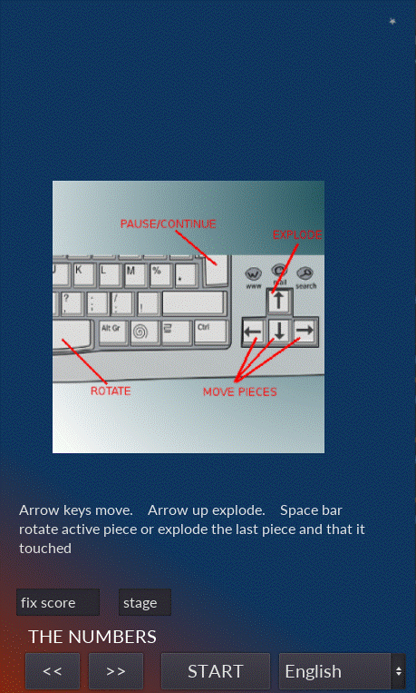  

> ## Typical level 1 - comparing two numbers 
> - The equality '8 = 8' will explode in the next second and points will be added to the scoreboard.   
> 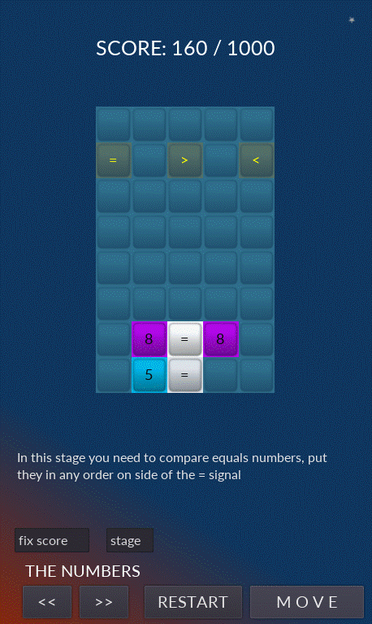  

> ## Typical level 2 - Comparing Arabic and Roman numerals 
> - The equality 'I = 1' will explode in the next second and points will be added to the scoreboard.   
> 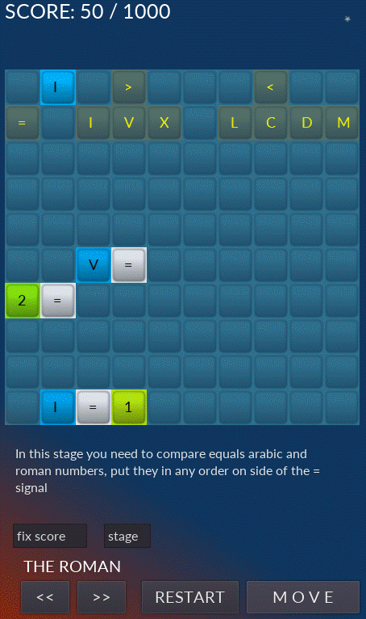  

> ## Typical level 3 - Solving additions 
> - The equality '7 = 1 + 6' will explode in the next second and the points will be added to the scoreboard. This equation flashes and changes color before exploding, so its numbers are red on a white background.(this is general behavior). Note that the number one walking left-right on the first line, use the down arrow to use correctly it in the game.  
> 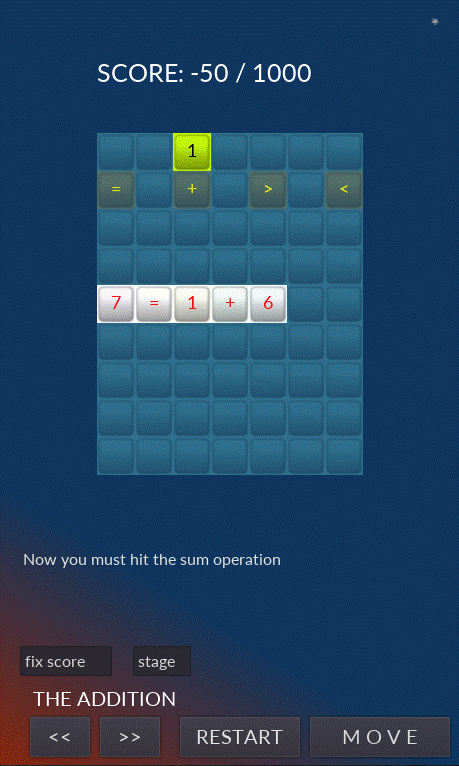 

> ## Typical level 4 - Solving subtractions 
> - The equality '9 - 6 - 1 = 2' will explode in the next second and the points will be added to the scoreboard.   
> 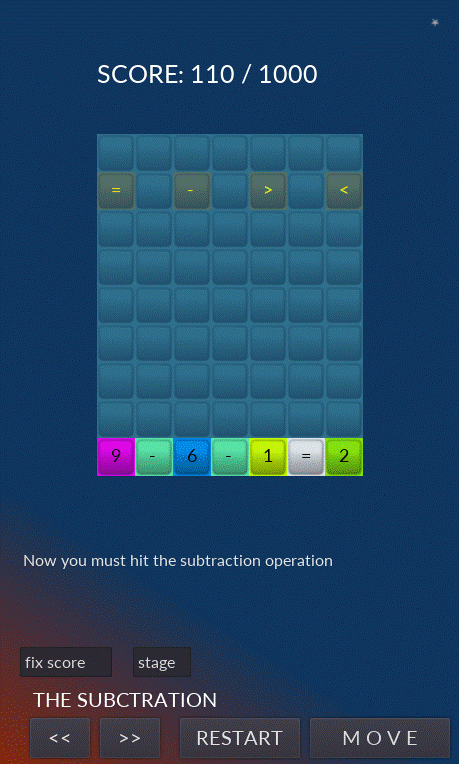  

> ## Typical level 5 - Solving additions and subtractions 
> - The equality '8 = 2 + 9 - 3' will explode in the next second and the points will be added to the scoreboard. This equation flashes and changes color before exploding, so its numbers are red on a white background.(this is general behavior)     
> 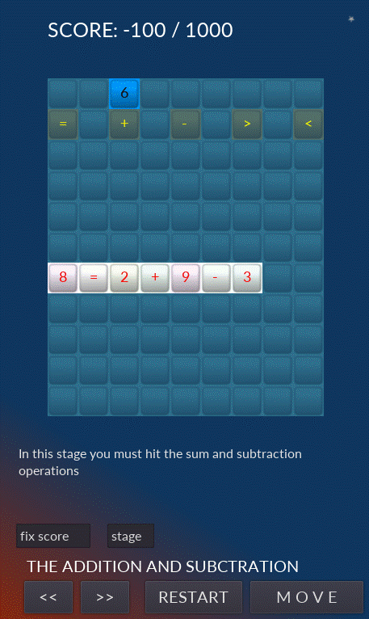 

> ## Typical level 6 - Solving multiplications
> - The equality '15 = 3 * 5' will explode in the next second and the points will be added to the scoreboard. Note that equations can also be vertical.  
> 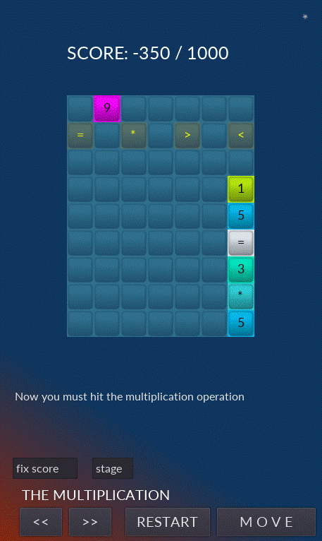  

> ## Typical level 7 - Solving divisions.
> - The equality '6 / 2 = 3' will explode in the next second and the points will be added to the scoreboard. Note that equations can also be vertical.  
> 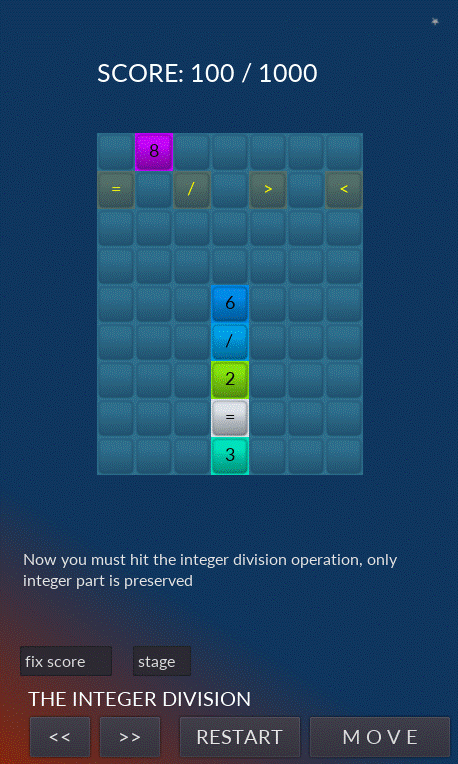  

> ## Typical level 8 - Comparing two fractions
> - The equality '1 / 2 = 4 / 8' will explode in the next second and points will be added to the scoreboard.   
> 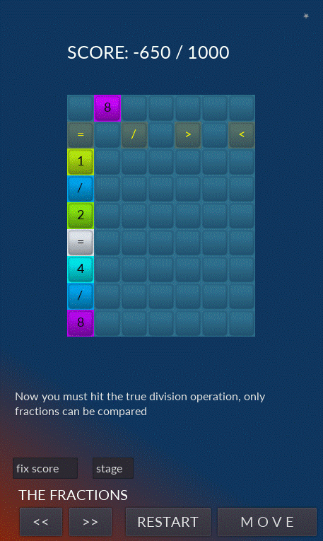  

> ## Typical level 9 - Solving rest of divisions.
> - The equality '1 = 5 % 2' will explode in the next second and the points will be added to the scoreboard. Note that equations can also be vertical. In this case 5 divided by 2 equals 2 with remainder 1, the remainder (rest) is the value that we wish to calculate with the '%' operator.   
> 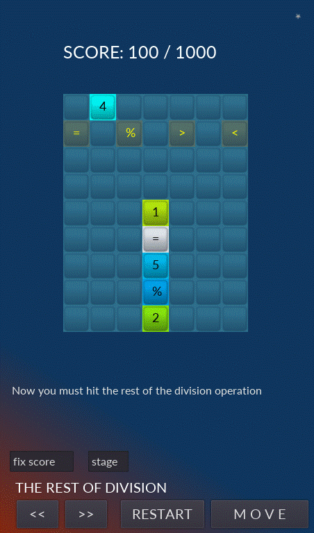 

> ## Typical level 10 - Solving additions, subtractions and multiplications.
> - The equality '5 * 4 = 7 + 7 + 7 - 1' will explode in the next second and the points will be added to the scoreboard. This equation flashes and changes color before exploding, so its numbers are red on a white background.  
> 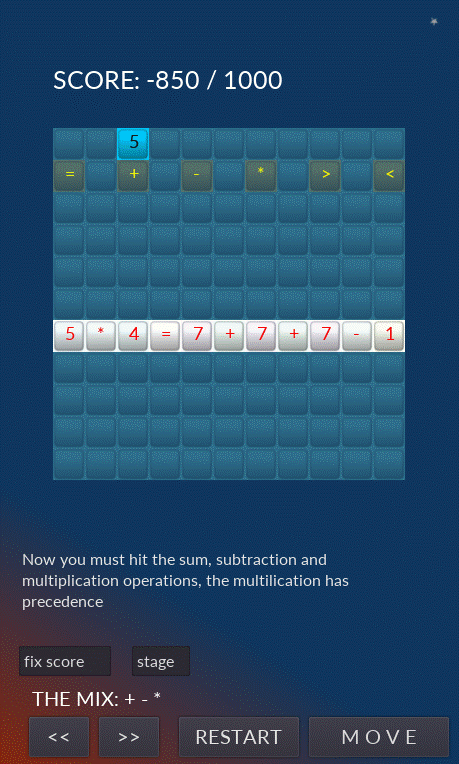 

> ## Typical level 10 in Portuguese - Solving additions, subtractions and multiplications.
> - The equality '9 = 4 * 2 + 1' will explode in the next second and the points will be added to the scoreboard. This equation flashes and changes color before exploding, so its numbers are red on a white background. This example is in Portuguese. (choose language on homepage)  
> 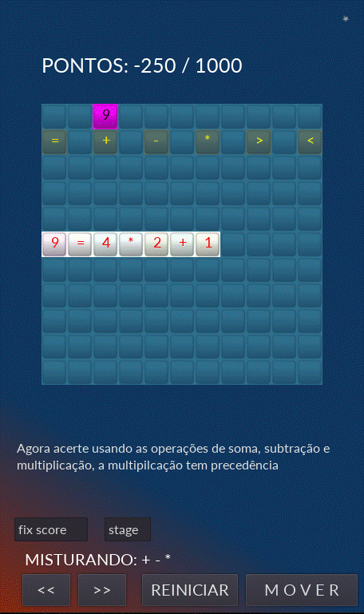 

> ## Typical level 11 - Solving additions, subtractions and multiplications with parentheses.
> - The equality '7 * 7 = 7 * ( 4 + 3 )' will explode in the next second and points will be added to the scoreboard. This equation flashes and changes color before exploding, so its numbers are red on a white background.     
> 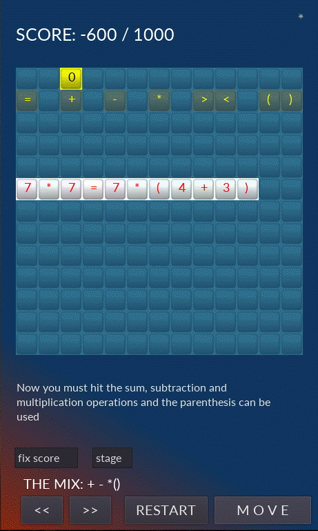 

> ## Typical level 12 - Solving additions, subtractions, multiplications and divisions with parentheses.
> - The equality '( 2 + 4 + 4 ) / 2 = 5' will explode in the next second and points will be added to the scoreboard.    
> 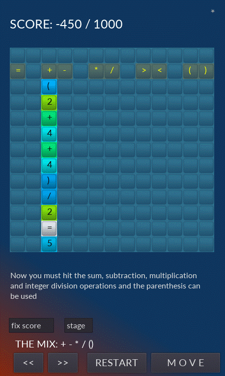  

> ## Typical level 13 - Solving additions, subtractions, multiplications,  divisions and rest of divisions with parentheses.
> - The equality '8 = 9 % 2 + 9 - 12 / 6' will explode in the next second and points will be added to the scoreboard. This equation flashes and changes color before exploding, so its numbers are red on a white background. Note the precedence of operators resolve in this order: () * / % + -        
> 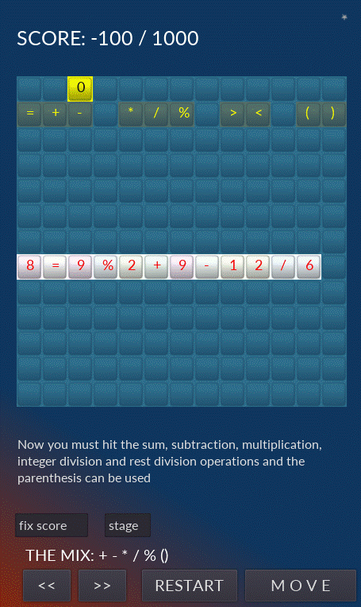 

# Models
> - Godot embraces object-oriented design at its core with its flexible scene system and Node hierarchy.
> - Tree of nodes (node: smallest building blocks) that you group together into scenes. 
> - Nodes communication each other by signals. 
> - A Script in GDScript language is a class that extend (inherit) a node class or you can create a new original one class.

# Tecnologies
> - Godot engine 2.1.4
>     - http://downloads.tuxfamily.org/godotengine/2.1.4/
> - GDScript (like python)

# Kick off
> - Download the engine and the game.
> - Start godot engine and import the engine.cfg in the root directory of the game.
> - Run in dev mode or compile (export) for android, ios, windows, linux, etc.

# Author
> Pedro Vitor Abreu
>
> <soft.pva@gmail.com>
>
> <https://github.com/softpva>
>

