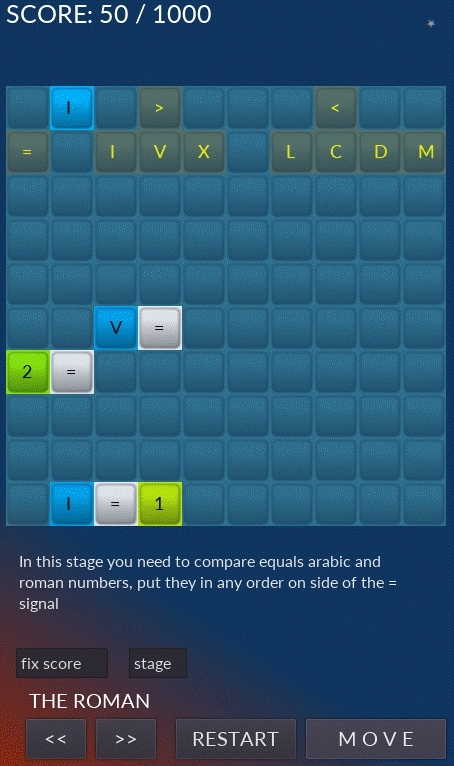
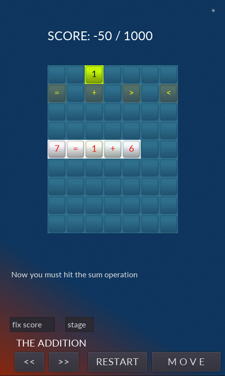
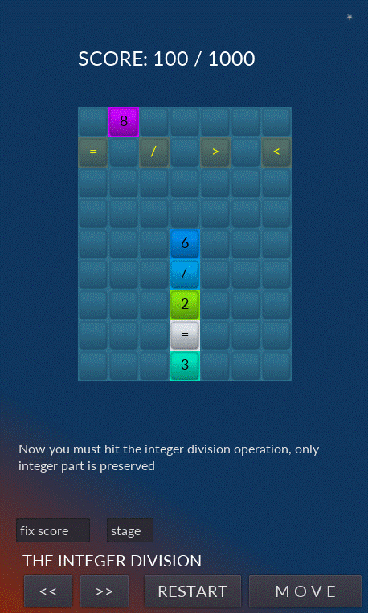
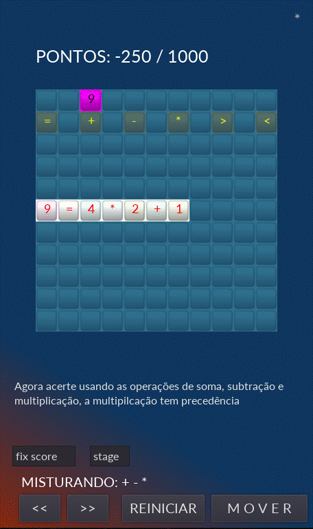

# **Tetris Math**

  

# Sobre
> - Este jogo 2D é parte de um conjunto experimental de jogos educativos que foi construido utilizando-se a Godot engine e usando a linguagem gdscript (parecida com python)
> - Você pode jogar um jogo tetris resolvendo muitas formas de operações matemáticas.  

# Aspectos
> - O jogo será interiamente refatorado e alguns poucos bugs corrigidos.
> - O jogo pode ser jogado em português ou em inglês.
> - A página inicial contém instruções básicas. (ver em layouts abaixo)
> - Na primeira linha é gerado um número aleatório que se move horizontalmente.
> - Na segunda linha o número acima citado pode se alterado em alguns dos símbolos nela marcados ou acrscido '>' ou diminuido '<' em uma unidade.
> - Atenção: por vezes são gerados dois números conjugados, então, um deles necessáriamente passará por um símbolo e será alterado.
> - Quando você acerta uma equação (uma igualdade) ela explodirá seus números e símbolos e pontos serão adicionados ao placar.
> - Quando você explode um número isolado pontos são diminuidos do placar.
> - A qualquer tempo você pode alterar a direção do número ativo.
> - Quando o número colidir com qualquer contorno ele se fixará nele.
> - Você pode aumentar a velocidade do número ativo apontando-o na mesma direção.
> - Você pode fazer o número andar passo a passo pressionando o botaõ pausa.
> - Qualquer comparação ou igualdade pode ser feita na horizontal ou na vertical.
> - A qualquer tempo você pode alterar os níveis presionando os botões '<<' e '>>', pausar ou reiniciar o jogo.
> - O grau de complexidade de cada nível é crescente, os exemplos abaixo (layouts) são dos passos iniciais e de mais simples solução.
> ---
> - O jogo possui treze diferentes níveis (fases):
> - 1. Compara dois inteiros
> - 2. Compara numerais arábicos com romanos.
> - 3. Solucionar a adição de dois inteiros.
> - 4. Solucionar a subtração de dois inteiros.
> - 5. Sollucionar uma mistura de adição e subtração.
> - 6. Solucionar a multiplicação de dois inteiros.
> - 7. Solucionar a divisão de dois inteiros com resto zero.
> - 8. Comparar frrações.
> - 9. Soluciona o resto da divisão de dois inteiros.
> - 10. Soluciona uma mistura de adição, subtração e multiplicação.
> - 11. O mesmo da anterior com o uso de parêntesis.
> - 12. Solucionar uma mistura de adição, subtração, multiplicação e divisão, pode-se usar parêntesis.
> - 13. Solucionar uma mistura de todas as operações acima.

# Layouts
> ## Página inicial com instruções básicas  
> - Os campos 'fixed scores' e 'stage' estão presentes apenas no modo de desenvolvimento.Através deles você pode saltar para diferentes níveis e fixar quanto pontos desejar no placar. Esta é a página para configurar o idioma para português ou inglês.  
>   

> ## Típico nível 1 - comparando dois números
> - A igualdade '8 = 8' explodirá no próximo segundo e pontos serão adicionados ao placar.   
>   

> ## Típico nível 2 - Comparando números arábicos com romanos
> - A igualdade 'I = 1' explodirá no próximo segundo e pontos serão adicionados ao placar.     
>   

> ## Típico nível 3 - Resolvendo somas 
> - A igualdade '7 = 1 + 6' explodirá no próximo segundo e pontos serão adicionados ao placar. Esta equação piscará e mudará de cor antes de explodir, por isso seus números estão vermelhos em um fundo branco.(este é um comportamento padrão). Note que o número 1 fica andando na primeira linha, use sempre a seta para baixo para usá-lo adequadamente.  
>  

> ## Típico nível 4 - Resolvendo subtrações
> - A igualdade '9 - 6 - 1 = 2' explodirá no próximo segundo e pontos serão adicionados ao placar.    
>   

> ## Típico nível 5 - Resolvendo somas e subtrações 
> - A igualdade '8 = 2 + 9 - 3' explodirá no próximo segundo e pontos serão adicionados ao placar. Esta equação piscará e mudará de cor antes de explodir, por isso seus números estão vermelhos em um fundo branco.(este é um comportamento padrão)  
>  

> ## Típico nível 6 - Resolvendo multiplicações
> - A igualdade '15 = 3 * 5' explodirá no próximo segundo e pontos serão adicionados ao placar. Note que as equações podem estar na vertical.  
>   

> ## Típico nível 7 - Resolvendo divisões
> - A igualdade '6 / 2 = 3' explodirá no próximo segundo e pontos serão adicionados ao placar. Note que as equações podem estar na vertical.    
>   

> ## Típico nível 8 - Comparando duas frações
> - A igualdade '1 / 2 = 4 / 8' explodirá no próximo segundo e pontos serão adicionados ao placar.     
>   

> ## Típico nível 9 - Resolvendo resto de divisões
> - A igualdade '1 = 5 % 2' explodirá no próximo segundo e pontos serão adicionados ao placar. Note que as equações podem estar na vertical. Neste caso 5 dividido por dois é igual a 2 com o resto de 1 (5/2 = 2*2+1), o resto, no caso 1, é o valor que desejamos calcular com o operador '%'.   
>  

> ## Típico nível 10 - Resolvendo adiçõe, subtrações e multiplicações
> - A igualdade '5 * 4 = 7 + 7 + 7 - 1' explodirá no próximo segundo e pontos serão adicionados ao placar. Esta equação piscará e mudará de cor antes de explodir, por isso seus números estão vermelhos em um fundo branco.(este é um comportamento padrão)  
>  

> ## Típico nível 10 em português - Resolvendo adiçõe, subtrações e multiplicações
> - A igualdade '9 = 4 * 2 + 1' explodirá no próximo segundo e pontos serão adicionados ao placar. Esta equação piscará e mudará de cor antes de explodir, por isso seus números estão vermelhos em um fundo branco. Este exemplo está em português. (escolha o idioma na tela inicial)  
>  

> ## Típico nível 11 - Resolvendo somas, subtrações e multiplicações usando parênteses
> - A igualdade '7 * 7 = 7 * ( 4 + 3 )' explodirá no próximo segundo e pontos serão adicionados ao placar. Esta equação piscará e mudará de cor antes de explodir, por isso seus números estão vermelhos em um fundo branco.       
>  

> ## Típico nível 12 - Resolvendo somas, subtrações, multiplicações e divisões usando parênteses
> - A igualdade '( 2 + 4 + 4 ) / 2 = 5' explodirá no próximo segundo e pontos serão adicionados ao placar.      
>   

> ## Típico nível 13 - Resolvendo somas, subtrações, multiplicações, divisões e restos de divisões usando parênteses
> - A igualdade '8 = 9 % 2 + 9 - 12 / 6' explodirá no próximo segundo e pontos serão adicionados ao placar. Esta equação piscará e mudará de cor antes de explodir, por isso seus números estão vermelhos em um fundo branco. Note a precedência dos operadores se resolvem nesta ordem: () * / % + -       
>   

# Modelos
> - Godot adota em seu núcleo um projeto com orientação a objetos com um sistema flexível de cenas e hierarquias em nós.
> - Árvores de nós (nó: o menor bloco de construção) que agrupa-os em cenas.
> - Nós se comunicam entre si através de sinais. 
> - Um script na linguagem GDScript é uma classe que estende (herda) uma classe nó ou uma nova classe original.

# Tecnologias
> - Godot engine 2.1.4
>     - http://downloads.tuxfamily.org/godotengine/2.1.4/
> - GDScript (parecido com python)

# Rodando o jogo
> - Faça o download do godot e do jogo.
> - Inicie o godot e importe o arquivo engine.cfg no diretório raiz do jogo.
> - Rode em modo de desenvolvimento ou compile (exporte) para android, ios, windows, linux, etc.

# Author
> Pedro Vitor Abreu
>
> <soft.pva@gmail.com>
>
> <https://github.com/softpva>